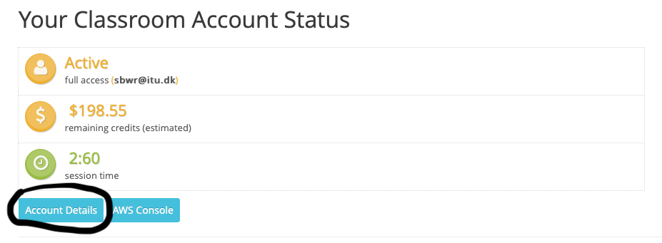
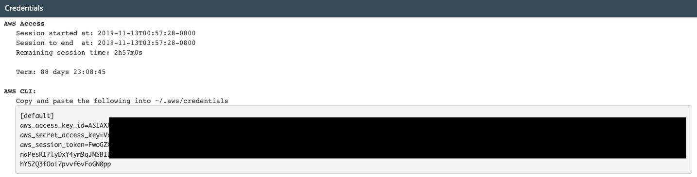

# Credentials

1. Sign in to https://aws.amazon.com/education/awseducate/
2. Go to "My Classrooms" and click the "Go to classroom". 
3. Click "Account Details" :



4. Click "Show" and copy everything in the box: 



The credentials expire every 3 hours, hence you will need to copy the credentials again after 3 hours. 

## For Mac/Linux users: 
Go to your home directory (which is where the Terminal opens, or accessible with "cd ~"). 
Make a new directory called ".aws" and create a new file in the directory called "credentials". Paste the credentials that you copied to this file. 
You can create the directory and the file in your terminal by executing: 

```bash
mkdir .aws
cd .aws
touch credentials
```

## For Windows users: 
Go to C:\\Users\\[user name].
Create a new directory called ".aws" and create a file in this directory called "credentials". 
Then paste the credentials from step 4 into the file and save. 

# Kinesis Stream
5. Open your AWS Console (the right button in the image in step 3) and click "Kinesis". 
6. Click "Create data stream". 
7. Give the stream a name (not containing special characters such as æøå or spaces).
8. Specify the number of shards (you can try 1-10 because we do not need high throughput capacity in this exercise). 
9. Click "Create Kinesis stream". 
10. Start up a regular EMR cluster. It does not have to be large, 1-3 nodes are appropriate. It makes sense to choose the same number of nodes as there are shards in the stream. 

# Local Kinesis Stream
11. Start KinesisWordProducerASL by executing: 

```bash
sbt "runMain dk.itu.BIDMT.Exercises.Exercise11.KinesisWordProducerASL [INSERT STREAM NAME] https://kinesis.us-east-1.amazonaws.com 10 10"
```

The two numbers in the end signify the number of records to send in total and the number of words in each record, respectively. 

12. Start the KinesisWordCountASL by executing: 

```bash
sbt "runMain dk.itu.BIDMT.Exercises.Exercise11.KinsesisWordCountASL KinesisCountSample [INSERT STREAM NAME] https://kinesis.us-east-1.amazonaws.com"
```

KinesisCountSample is the name that DynamoDB uses for the counter program to do statistics. You can call it whatever you want (do not use special characters).  

13. Step 11 and step 12 needs to be run simultaneously. 

# Cluster Kinesis Stream
14. Assemble the JAR file using: 

```bash
sbt assembly
```
15. Copy the JAR file and the "run.sh" file to the cluster. See earlier exercises if you are in doubt of how to do this. 
16. Execute "run.sh" twice on the cluster. You need to open two terminals logged into the cluster (either with ssh or Putty). The first Terminal needs to execute: 

```bash
./run.sh 1 [INSERT STREAM NAME] [recordNum] [wordsPerRecord]
```

And the second: 

```bash
./run.sh 2 [INSERT STREAM NAME]
```

# References
Spark Streaming + Kinesis Integration: 
https://spark.apache.org/docs/latest/streaming-kinesis-integration.html

Supplying and Retrieving AWS Credentials: 
https://docs.aws.amazon.com/sdk-for-java/v2/developer-guide/credentials.html