# Exercise 7

In this exercise, you will learn how to build and execute a Spark program in an AWS cluster.

# Test the project

Run the project as it is:

```bash
sbt run
```

it should write out two previews of the datasets loaded plus the number of lines in the medium dataset (in the file data/medium_dataset.csv).

# Start your cluster on AWS
You can follow the guide (AWS Cluster Setup) from the previous week's exercise session. You can optionally create a cluster with 3 or more nodes instead of the two nodes specified in the guide. 

# Transferring local files to the Cluster

## Windows

For Windows users without access to a Linux shell like WSL or Cygwin, it is strongly recommended that you use FileZilla (though you can use other FTP clients if you prefer) in order to transfer your files to the cluster.

1. Download and install FileZilla from https://download.filezilla-project.org/client/FileZilla_3.45.1_win64_sponsored-setup.exe

2. Open up FileZilla. The interface should look like the image below.

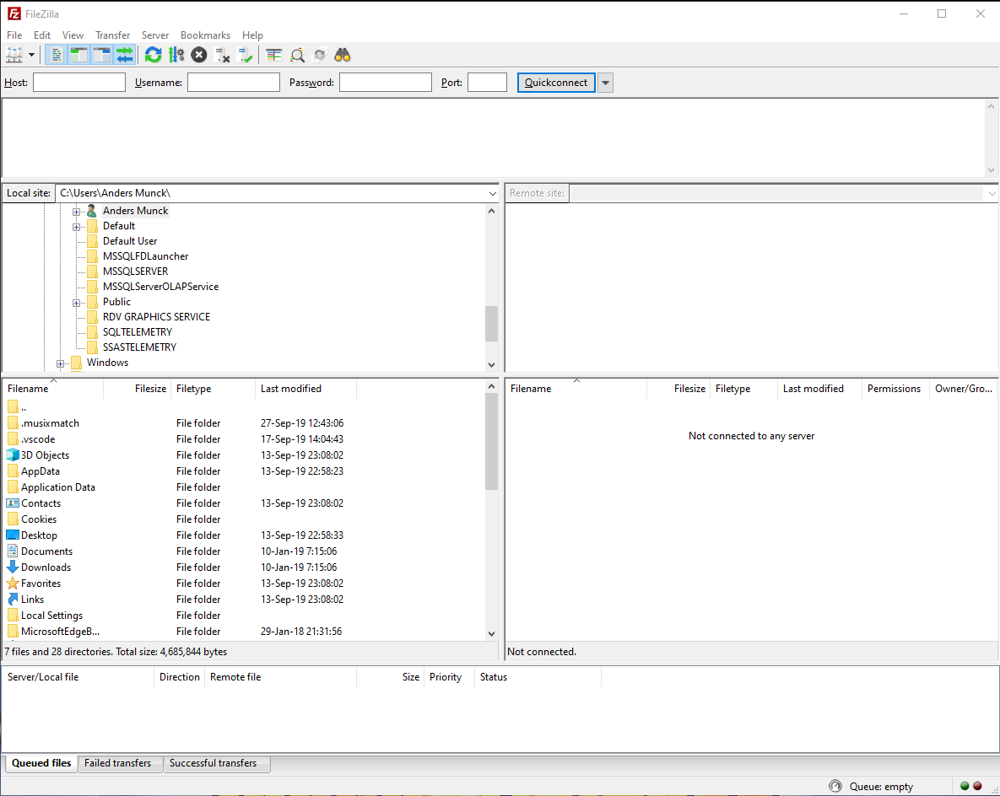

3. Open the 'File' tab at the top and then click 'Site Manager'. This is where you'll add the cluster server to FileZilla. A new window should open.

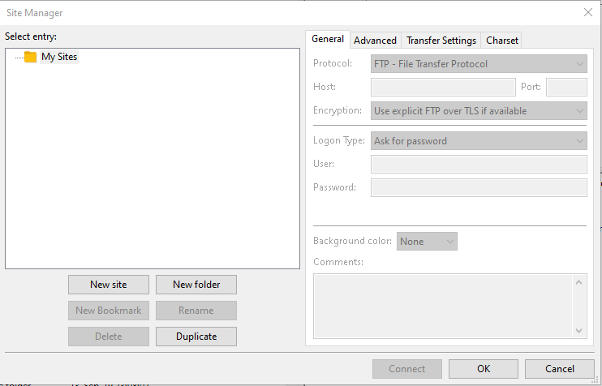

4. Click 'New Site' and name it on the left. Then, on the right side you'll want to set the 'Protocol' to 'SFTP', which is essentially file transfers via SSH. You'll then set the 'Host' to the DNS of your cluster - in this guide the 'ec2-3-94-181-107.compute-1.amazonaws.com' part. Then set the 'Port' to '22'.

5. Next youll set up the 'Logon type' to be 'Key file'. Then set the 'User' to 'hadoop' and click 'Browse'.

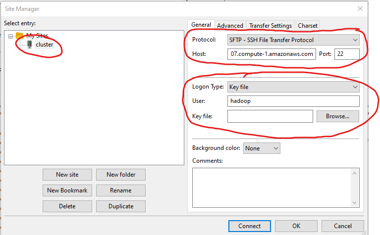

6. Browse to where your key file is located and select it --- you should note that there are two options for the keyfile types: either .pem, which is the file you originally got from AWS when you created your key file or .ppk, which is the file that you created with PuTTYgen last exercise session. Either one will work. Once you have selected your file, click 'OK' in the 'Site Manager' window.

7. Once back in the client click the icon in the top left of the window and then click the name of the cluster, which you gave it in the configuration window. It will then ask you if you'll trust the server --- again, you'll say yes to this security pop-up.

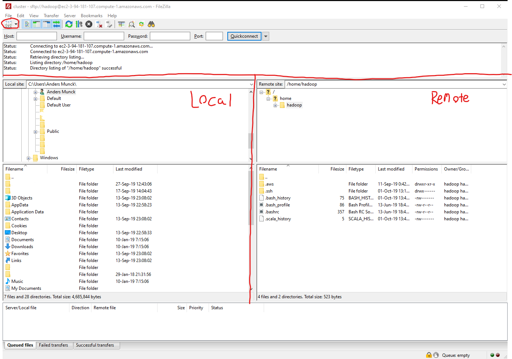

8. And voila! You'll now be connected to your cluster and you can transfer files by navigating on your pc in local window on the left and dragging the folders/files onto the remote server's explorer window.


## Linux / MAC / BASH clients

For Linux and MAC users the process should be somewhat more simple: you can use the SCP command, which we showcased last exercises session.

You use this command by typing in 
```bash
scp -i [PATH-TO-YOUR-.PEM-KEYFILE] [local file] user@address:[remote file]
```

So an example of this (with login details) would be:
 
```bash
scp -i ~/.ssh/aws_key.pem data/medium_dataset.csv hadoop@ec2-3-94-181-107.compute-1.amazonaws.com:medium_dataset.csv
```

Please note that the file paths are relative to where you currently have your terminal open.

If you wish to copy entire folder, you can do so by adding the '-r' parameter to your command, like so:
```bash
scp -i [PATH-TO-YOUR-.PEM-KEYFILE] -r [local folder name] user@address:[remote folder name]
```

# HDFS
Before continuing, please copy the entire 'data' folder in the exercise folder to your hadoop cluster using either of the two methods outlined above.

On the cluster there is access to the distributed file system through the HDFS commands.

The commands we are interested in are the following two commands:

```bash
hdfs dfs -rm -r data
```

Which we use in order to make sure that we do not already have a 'data' folder contained within our HDFS. At this stage we shouldn't have - but you need to know this command because if you change your data locally and then upload the data to the cluster again, it does not change the data contained within the HDFS! So you'll want to remove any old data and then put your new data into the HDFS.

Speaking of put, this command is what you use to put folders/files into the HDFS.

```bash
hdfs dfs -put data
```

And that's it!

In order to see what you have on the HDFS you can use the following command:

```bash
hdfs dfs -ls .
```

This shows the root directory contents.
To see what you transferred to the data directory use './data' instead of '.'

# Build and send your project.

To execute code on the cluster you have to build jar files and submit them to Spark on the cluster.

The SparkDemo.scala file has to be changed. The line with:
```scala
.master("local")
```
needs to be removed before transferring the jar-file to the cluster. 

Also the SBT-file has to be updated, so that it knows that spark-core, spark-sql and spark-yarn are provided on the server. 

This is done by adding "provided" in the end of the libraryDependencies lines:

```sbt
libraryDependencies += "org.apache.spark" %% "spark-core" % "2.4.4" % "provided"
libraryDependencies += "org.apache.spark" %% "spark-sql" % "2.4.4"  % "provided"
libraryDependencies += "org.apache.spark" %% "spark-yarn" % "2.4.4" % "provided"
```

## Additional configuration details
When working with the AWS Spark cluster it becomes absolutely necessary to set the scalaVerison in the build.sbt to '2.11.12'. 
This is the scala version that the clusters use to run Spark 2.4.4.

This should also be check/done for any future projects.

## Building your project to a .jar and submitting it to your cluster

In order to build your project to a single .jar file you should use:

```bash
sbt assembly
````

which will construct a jar file (including all the dependencies) and save it within the project folder's "target/scala-2.11" with the name "Exercise6-assembly-1.0.jar".

You should then move this file to the cluster using either of the transfer methods previously described.

To execute the jar, use the command when logged in via ssh:

```bash
spark-submit Exercise6-assembly-1.0.jar
```
This will execute the jar using your console as output. This means that you are not able to close the console and keep the jar running, hence you need to look at the next option if you need to run something while logged off the server. 

Log into the cluster and execute:

```bash
spark-submit --master yarn --deploy-mode cluster [PATH-TO-YOUR-JAR]
```

When using this option a lot of extra things happen and if you want information about what is written to console for instance you can get the **yarn** log by using

```bash 
yarn logs --applicationId <applicationId> > results.txt
```

This makes a file containing the results in a txt file. The application number should look like: **application_1527748806482_0047**. If you go to your AWS Console, you have an overview of running clusters, where you can also see the application ID. 
When logged into the cluster, you can execute the command:

```bash
yarn application -list
```

This will display the running YARN applications. The list also contains the application numbers. 

Before running the jar file again, you have to kill the old applications. This is done with the following command:

```bash
yarn application -kill <applicationId>
```

# Get Data from HDFS

After execution of the code, an output can be retrieved from HDFS by using the following command:

```bash
hdfs dfs -getmerge out out.csv
```

This command will take the data output from the folder "out" in the Hadoop file system (HDFS) and output it to our file system in the file "out.csv". You can now see the output by running: 

```bash
cat out.csv
```

# Checking the runtime of application using the Spark web interface

The cluster actually provides us with a lot of different web interfaces, which we can utilize in order to monitor our cluster and the applications that it executes.

One of the most important ones is the Spark web interface, which lets you know exactly how much time each task took to execute and how much data was handled within each step of the programme execution.

In order for us to actually access this web interface we will have to open up an SSH tunnel to the cluster and forward the port of the web service to our own machine.

## Port Tunneling using PuTTY (Windows)

Port tunneling in PuTTY is a bit of more work when you're setting up the connection. Firstly you should set up your connection as outlined in the guide from last exercise session, i.e. your setup should look like this:

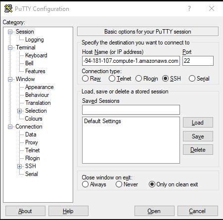
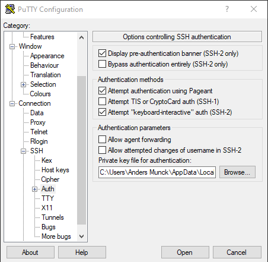

Once this is done, you should click the 'Tunnels' tab in the sidebar below 'Auth'. Here you should then fill in the 'Source port' with some open and available port on your PC - for example port 8000.

In the 'Destination' field you should fill in the address of your cluster + port 18080. An example here would be: 'ec2-3-94-181-107.compute-1.amazonaws.com:18080'.

Your PuTTY window should now look like this:

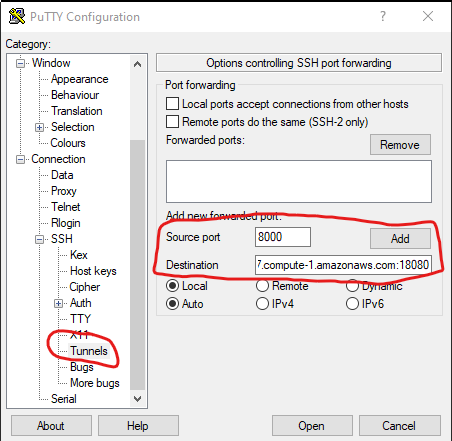

Then click 'Add' and then click 'Open'. The terminal should then appear and while this window to the server is open, the port tunnel will be active.

This binds your local port 8000 to the remote server's port 18080 and allows you to access the web interface of the service by simply typing in 'localhost:8000' into your browser.

## Port Tunneling using SSH (MAC/Linux/BASH)

You have to add some extra commands to your existing SSH command:

```bash
ssh -i [PATH-TO-YOUR-.PEM-KEYFILE] -N -L [FREE LOCAL PORT]:address:[REMOTE SERVER PORT] user@address
```

An example of this would then be:

```bash
ssh -i ~/.ssh/aws_key.pem -N -L 8000:ec2-3-94-181-107.compute-1.amazonaws.com:18080 hadoop@ec2-3-94-181-107.compute-1.amazonaws.com
```

This binds your local port 8000 to the remote server's port 18080 and allows you to access the web interface of the service by simply typing in 'localhost:8000' into your browser.

Do mind - this port tunneling only exists as long as you keep the terminal window open. If you wish to do something else on the cluster in the meantime, you'll have to open another terminal.

## The Spark web interface

Now that the tunneling has been set up, we can go on and access the web interface, which should look something like this:

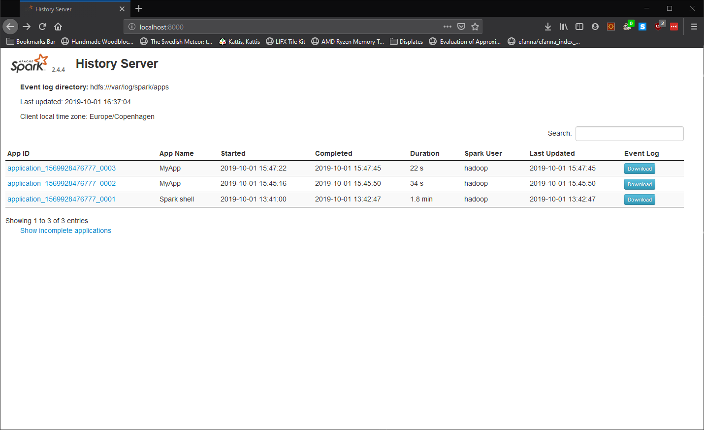

If you've run any application on this cluster (which you should have if you followed the guide), it should list them. By clicking on the 'App ID' link you can further open the details of the application runtime, in the form of a list of 'jobs'.

These jobs signify parts of the execution of your application's code. An example of this job list is displayed here:

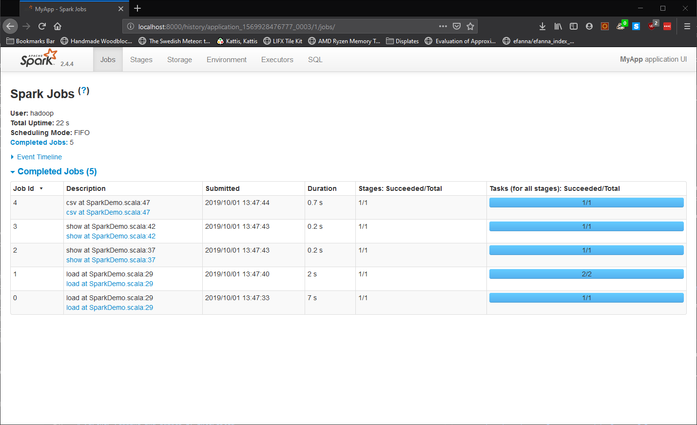

On this page you can also see a timeline fo the execution of these jobs. Further opening up a job by clicking on the link in the 'Description', such as job no. 3 in the image, allows for a further digest of an individual job.

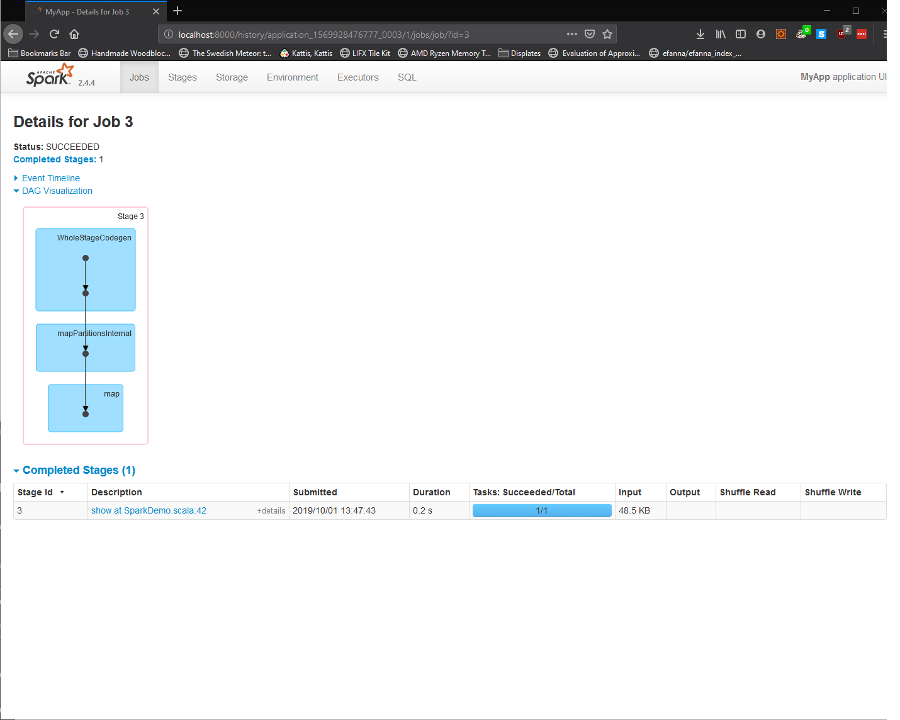

From here you can click on the 'DAG Visualization' in order to see which underlying functions your code called on the data loaded into the HDFS. 

If you wish to trace where the code was executed you can click the grayed out '+details' in the 'Description' field, which then will give a class and line trace of the code.

Further clicking the link in the 'Description' field will give you a complete breakdown of the exact job in terms of:
1. Inner scala functions called in the 'DAG Visualization'
2. The timeline of the exact job in the 'Event Timeline' 
3. The metrics of the job in terms of CPU runtime ('Duration')
4. The Garbage Collector runtime (GC Time; should not be included when measuring total execution time!)
5. The size of the input data to the job (Input Size / Records).

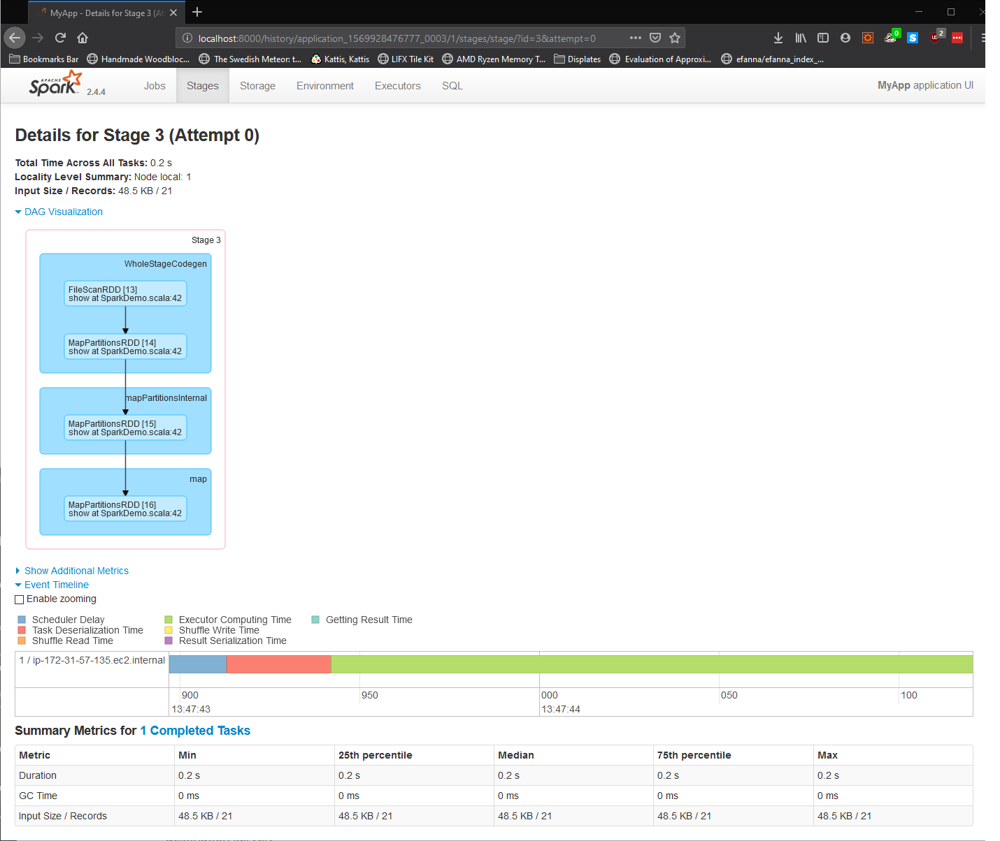

Now as a matter of fact, the job showed in the examples corresponds to the code written in the SparkDemo.scala file from lines 39 to 42.

Now some of you might observe that all of the functions called point to line 42, although way more functions are called in line 39-40. This is due to the fact that Spark uses a 'lazy execution' of code, which essentially means that Spark will not execute the code you've written until you actually request it or further operate on it. 

All of the code in line 39-40 is essentially deferred from being executed until .show() is called in line 42, because Spark tries to not operate until it is forced to.

## Other web interfaces

All of the exposed web interfaces from the master node are detailed here:
https://docs.aws.amazon.com/emr/latest/ManagementGuide/emr-web-interfaces.html

In order to use any of the other interfaces, you'll have to make an SSH tunnel for each of these web services.

# Terminate Cluster
Remember to log into your AWS Console and terminate your cluster when you are done. 


# Further reading and guides if interested

Links
Spark Dataset, DataFrames and RDD Programming guide:

https://spark.apache.org/docs/latest/sql-programming-guide.html

Spark Scala documentation:

https://spark.apache.org/docs/latest/api/scala/index.html#org.apache.spark.package

AWS Spark Guide:

https://aws.amazon.com/blogs/big-data/submitting-user-applications-with-spark-submit/

